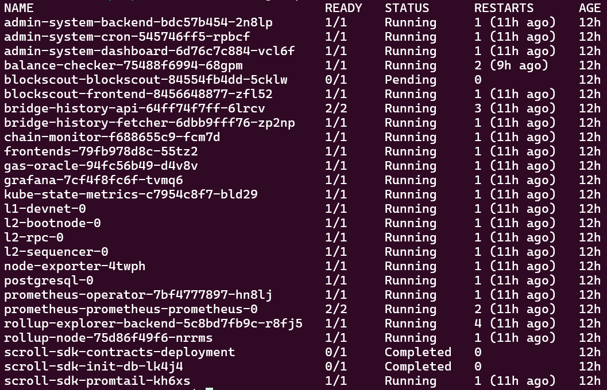
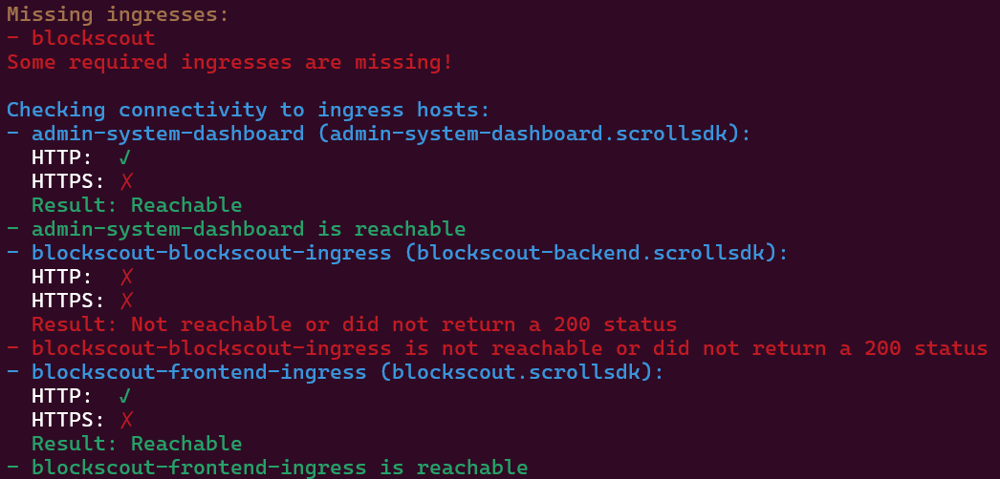
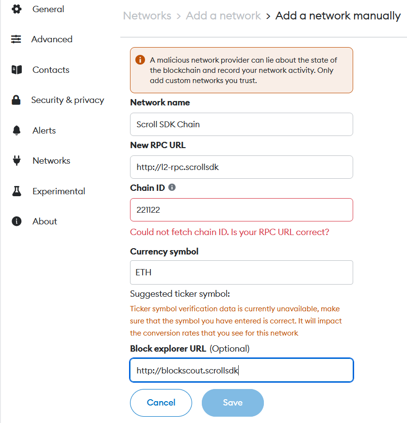

# **Adjusted Setup of the SDK Devnet from Scroll**

During the EthGlobal Bangkok hackathon, I tried to do the Scroll SDK Devnet set up on a Windows Subsystem for Linux (Ubuntu). While following the [official guide](https://docs.scroll.io/en/sdk/guides/devnet-deployment/) and [video tutorial](https://www.youtube.com/watch?v=r7MMAg0Menw), I encountered several issues that required adjustments. Below is a summary of the challenges and their solutions:

---

### **Issue 1: Configuration Adjustment**



- **Problem:** After running `make bootstrap`, I encountered errors related to Blockscout. Continuing with `make install`, the process stalled, and errors occurred.
- **Solution:** The Minikube configuration was adjusted. Instead of using:
    ```bash
    minikube config set cpus 8
    minikube config set memory 8192
    ```
    or the recommended:
    ```bash
    minikube config set cpus 8
    minikube config set memory 6592
    ```
    I used:
    ```bash
    minikube config set cpus 8
    minikube config set memory 7592
    ```
    This resolved most issues and allowed the setup to proceed.

---

### **Issue 2: Blockscout Errors**



- **Problem:** 
The `blockscout-blockscout-84554fb4dd-5cklw` pod remained in a `Pending` state. Additionally, `kubectl get ingress` did not list the expected `blockscout-backend-ingress` or `blockscout-frontend-ingress`.
- **Solution:** This issue was left unresolved as it did not block further progress. Running `scrollsdk test ingress` confirmed Blockscout was unreachable, but the setup could still continue.

---

### **Issue 3: Accessing the Frontend**
- **Problem:** Opening `http://frontends.scrollsdk` in the host browser resulted in a blank page.
- **Solution:** Installing browsers within the Ubuntu subsystem allowed me to access the frontend. Here’s how I set them up:

#### **Installing Chrome**
1. Create a directory for the installer:
   ```bash
   mkdir chrome
   cd chrome/
   ```
2. Download and install Chrome:
   ```bash
   wget https://dl.google.com/linux/direct/google-chrome-stable_current_amd64.deb
   sudo dpkg -i google-chrome-stable_current_amd64.deb
   sudo apt-get install -f # Fix missing dependencies
   google-chrome-stable
   ```

#### **Installing Firefox**
- I followed the "Install Firefox .deb package for Debian-based distributions" section from [Mozilla's guide](https://support.mozilla.org/en-US/kb/install-firefox-linux).

Both browsers worked when launched from the subsystem, allowing access to the Scroll frontend.

---

### **Issue 4: Connecting Scroll SDK Chain RPC to MetaMask**



- **Problem:** Adding the Scroll SDK Chain to MetaMask in Chrome or Firefox on the host browser was not possible, as MetaMask did not allow me to save the network.
- **Solution:** Installing MetaMask in the Ubuntu subsystem browsers (Chrome and Firefox) resolved this issue. I was able to add the Scroll SDK Chain using the following details:
  - **Network Name:** Scroll SDK Chain  
  - **New RPC URL:** `http://l2-rpc.scrollsdk`  
  - **Chain ID:** `221122`  
  - **Currency Symbol:** `ETH`
  - **Block Explorer URL:** `http://blockscout.scrollsdk`

This allowed me to interact with the Scroll SDK via MetaMask.
